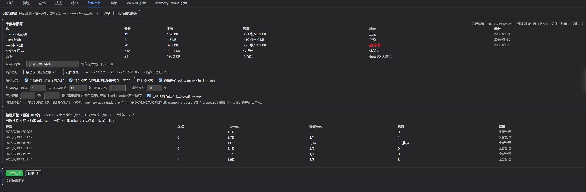

# dsh-memory-steward · 记忆管家

> 给 [dsh-memory-evolve](https://github.com/csyangwen/dsh-memory-evolve) 补上**记忆入库之后**的那半程：
> 预算看门狗 → 整理到期提醒 → 模型出方案 → 你在 Tab 审批 → 带备份执行。

<p>
  
  
  
</p>

**前置依赖**：本插件是 memory-evolve 的**伴生治理层**，单独装它没有意义——所有执行都回调它的官方 HTTP API，
记忆的存储与单写者永远是上游。零代码耦合：只依赖 4 条官方路由（`memory/delete|update|archive`、`memory-files`）与 6 个记忆文件路径。

## 它解决什么问题

上游把「记忆入库」做得很完整（五轨 · 审查 · 技能 · 合并规则），但入库之后没人管：

| 你会遇到的问题 | 管家做什么 |
|---|---|
| 记忆悄悄涨到超预算，没人告诉你 | 三轨条数/字节对照预算（固定阈值，或设基准后按 ×倍率）；**只在超预算时**往 systemPrompt 注入一行 |
| 「是不是该整理了」全靠人想起来 | 超预算**或**归档超量 + 距上次整理够天数 + 无待审 → 提醒里直接给出这一轮怎么跑（轻量模式先跑归档预筛，省 token） |
| 整理方案靠会话临场发挥，判完就散 | `memory_propose` 提交成**待审批队列**：红点、勾选/全选/反选/批量采纳、拒绝、恢复待审 |
| 改错了回不去 | 每次执行前把 6 个记忆文件**整份备份**；失败可断点续跑（已成功的 op 不重放） |
| 提案正文与执行回显把队列文件撑爆 | 三层治理：队列只留 pending + 最近 N 条已结项；正文只活在队列与 `backups/`；另有只追加的事件日志（一行 ≈200 B，含摘要与失败原因，不含正文） |

**实测**（本机 13 条历史）：`proposals.json` **147,788 → 13,855 B**；Tab 每 15s 轮询的列表接口 **138,849 → 5,934 B**。

## 它长什么样



一个 Tab 装下：库存与预算（三轨条数/字节 vs 预算）· 全自动采纳与预算基准 · 触发方式与整理参数 ·
历史保留策略（最近 N 条 / M 天 / 已结项精简正文）· 整理开销审计（每轮 ≈tokens）· 待审批与历史列表。

## 安装

```bash
# 1. 先装伴生插件（记忆的存储与单写者）
dsh plugin --profile web add github:csyangwen/dsh-memory-evolve

# 2. 再装管家
dsh plugin --profile web add github:rezon-aki/dsh-memory-steward
# 发布到 npm 之后也可以：dsh plugin --profile web add dsh-memory-steward
```

重启 `dsh web` 即生效（`cordis.patch.yml` 由 bundle 清单自动注册，**不要**再手动 insert 同 id）。
会话视图会多出「整理审批」Tab；有待审时标题带 🔴 计数。

## Tab 里有什么

- **库存与预算**：三轨条数/字节 vs 预算、最老条目、到期状态（超预算/归档超量/距上次整理）
- **待审批列表**：勾选、全选/反选、批量采纳/拒绝；「▸ 查看详细」**展开时才按需拉正文**（原记忆 → 修改后）
- **历史**：保留策略与「已淘汰/已精简」计数、单条删除记录、清空历史、清理事件日志（留 7 天 / 清空，都带 confirm）
- **整理开销**：最近 N 轮的 ≈tokens（盘点输入 + 提案输出），超目标标红
- **配置区**：自动检查 / 注入提醒 / 轻量模式 / 整理间隔 / 归档阈值 / 预算倍率 / 审计保留轮数 / 历史保留（条数·天数·精简）/ 自动采纳

## 三个工具

| 工具 | 用途 |
|---|---|
| `memory_audit` | 库存/预算/候选簇/归档预筛/条目清单。`deep` 跑上游扫描器；`archiveCheck` 归档预筛（三桶：疑似已收录/归档独占/待判，最省 token）；`track:'all'` 一次拉全量 |
| `memory_propose` | 提交提案（单条或 `proposals` 数组批量 ≤20 条）：`archive` / `remove` / `replace` / `purge`。`match` 只需唯一子串，host 解析成整条正文 |
| `memory_sweep_status` | 到期查询（`check`）与计时复位（`complete`） |

## 安全边界

- **绝不直接写记忆文件**：写入一律走 memory-evolve 官方 HTTP API（带 `origin` 头）；单写者永远是它。
- **执行锁**：每条提案同时只跑一次——并发/重复提交会被挡掉（曾因批量按钮双击造成「已成功却标 failed」）。
- **提案期校验**：`replace` 的新正文不能为空、不能含条目分隔符 `§`（等到审批才炸太晚）。
- **一键自检**：`node scripts/selfcheck.mjs` → 技能同步 / 状态目录可写 / 客户端 bundle 组合 / 上游写入契约 / 上游存活 / 工具注册 / 队列可读，逐项 PASS-FAIL。**缺上游时报 FAIL，而不是静默失灵。**

## 成本

插件本身**不调 LLM**——判读由会话里的模型做。一轮整理的开销 = 盘点清单（输入）+ 提案正文（输出），按字符 ÷2 估算，
常规轮次目标 **≤2K tokens**（合并类 `replace` 要把新旧正文都写进 ops，一轮大重构 10K+ 属正常）。
`/api/rounds` 与 Tab 的「整理开销」卡片同口径。

## 配置

Tab 里改，落盘在 `<memoryDir>/steward/config.json`（默认 `~/.dsh/memories/steward/config.json`）：

| 键 | 默认 | 说明 |
|---|---|---|
| `autoCheck` | true | 自动检查：12h 定时 + 回合末刷新库存 |
| `nudge` | true | 超预算/到期时往 systemPrompt 注入一行提醒 |
| `lightMode` | true | 提醒里优先建议 `archiveCheck` + `deep`，候选多再拉全量 |
| `sweepIntervalDays` | 7 | 距上次整理够多少天才再次提醒 |
| `archiveMaxEntries` | 30 | 归档轨条数阈值（超过也视为「该做一轮」） |
| `budgetRatio` | 1.5 | 设基准后：预算 = max(固定阈值, ⌈基准 × 该值⌉) |
| `roundKeep` | 10 | 开销审计滚动保留轮数 |
| `historyKeep` | 20 | 队列保留最近 N 条已结项 |
| `historyKeepDays` | 30 | 已结项早于 M 天才可能被淘汰/精简（与 N 取「且」） |
| `historySlim` | true | 已结项正文精简（有备份即精简，正文只留 `backups/`） |
| `autoApprove` | off | `off` / `deterministic`（只自动跑确定性归档）/ `all` |
| `baseline` | null | 预算基准快照；设了就用「基准 ×倍率」而非固定阈值 |

**纯手动模式** = `autoCheck:false` + `nudge:false`（Tab 一键）：此后只有工具/API 调用才刷新、才产提案。

## HTTP API

同一 webServer，带 Host/Origin 围栏（跨站请求 403）：

| 路由 | 说明 |
|---|---|
| `GET /api/status` | 库存、预算、到期状态、历史统计、技能同步状态、客户端 bundle 路径 |
| `GET /api/proposals` | **轻量列表**（不含 ops/results 正文）；`GET /api/proposals/:id` 按需取完整 ops |
| `POST /api/proposals/{approve,reject,restore,purge}` | 审批动作（空 ids 的 purge = 清空历史，待审保留） |
| `POST /api/propose` / `POST /api/scan` | 外部提交提案 / 跑确定性重复检测 |
| `POST /api/config` / `POST /api/baseline` | 改配置 / 设或清预算基准 |
| `GET /api/rounds` | 整理开销审计 |
| `GET /api/selfcheck` | 自检（同 `scripts/selfcheck.mjs`） |
| `POST /api/history/clear` | 事件日志：`{days:N}` 删 N 天前、`{all:true}` 整文件删（只删日志） |

## 开发

**无构建步骤**：`lib/index.js`（host，ESM）与 `lib/client.js`（client，`window.__ModuleLoader__.load` 包装的 CJS）就是源码。

```bash
npm test                     # 31 例，node --test，不需要安装任何依赖（Node ≥ 20）
node scripts/selfcheck.mjs   # 对运行中的实例逐项自检（加 --json 看原始返回）
node scripts/fixture.mjs seed|status|clear   # 造/查/清浏览器验收夹具（原样重写，不改语义）
```

测试用三件套：假 ctx（收集注册的工具/路由/提示词）+ 临时记忆库 + 一个同时扮演管家 API 与 memory-evolve API 的本地服务；
客户端测试用迷你 React 把 `lib/client.js` 当浏览器 bundle 渲染，并断言「展开详情确实按需请求」。

- 设计文档：[docs/ARCHITECTURE.md](docs/ARCHITECTURE.md)
- 人机分工的验收清单：[TESTING.md](TESTING.md)
- 变更记录：[CHANGELOG.md](CHANGELOG.md)

## 许可

MIT。伴生插件 [dsh-memory-evolve](https://github.com/csyangwen/dsh-memory-evolve) 亦为 MIT。
